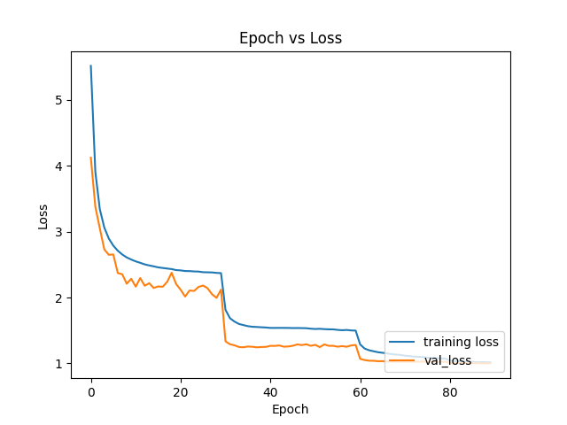
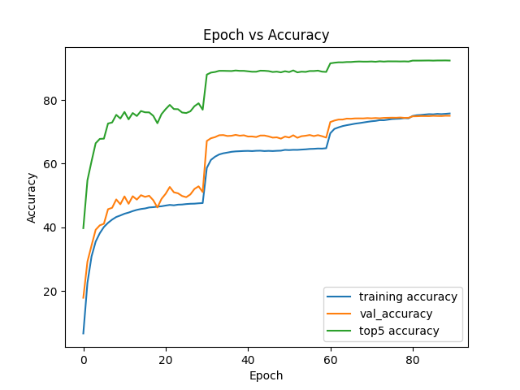

# pytorch_resnet_implementation

<!-- This repository is an implementation of the ResNet50 from:

Will train on imagenet and cifar10 -->

This repo is a implementation of the ResNet architectures from the following paper:
"Deep Residual Learning for Image Recognition"

The paper can be found at https://arxiv.org/pdf/1512.03385.pdf

The ResNet50 architecture statistics and graphs are shown below:

Overall statistics
- Top 1 Validation Accuracy  = 75.03 %
- Top 5 Validation Acccuarcy = 92.37%

Graphs:

To reproduce results you will need a single server with n gpus. Otherwise take a look at the train_distributed script and launch training using that. 
