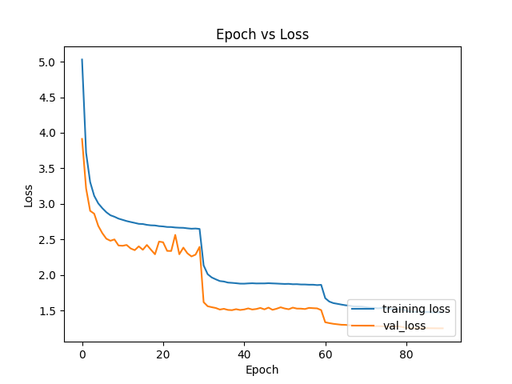
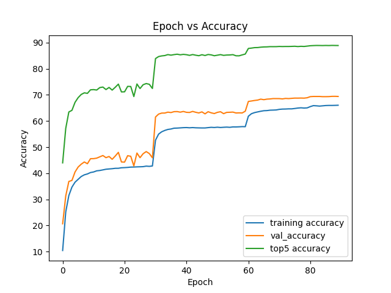

# pytorch_resnet_implementation

<!-- This repository is an implementation of the ResNet50 from:

Will train on imagenet and cifar10 -->

This repo is a implementation of the ResNet architectures from the following paper:
"Deep Residual Learning for Image Recognition"

The paper can be found at https://arxiv.org/pdf/1512.03385.pdf

Here the ResNet18 and ResNet50 architectures are trained with the plots below 

The ResNet18 architecture statistics and graphs are shown below: 

Overall Statistics:
- Top 1 Validation Accuracy = 69.04%
- Top 5 Validation Accuracy = 88.91%

Graphs:

The ResNet50 architecture statistics and graphs are shown below:

Overall statistics
- Top 1 Validation Accuracy  = 75.03 %
- Top 5 Validation Acccuarcy = 92.37%

Graphs:

To reproduce results you will need a single server with 1+ gpus, use the train_distributed script to launch training. 
